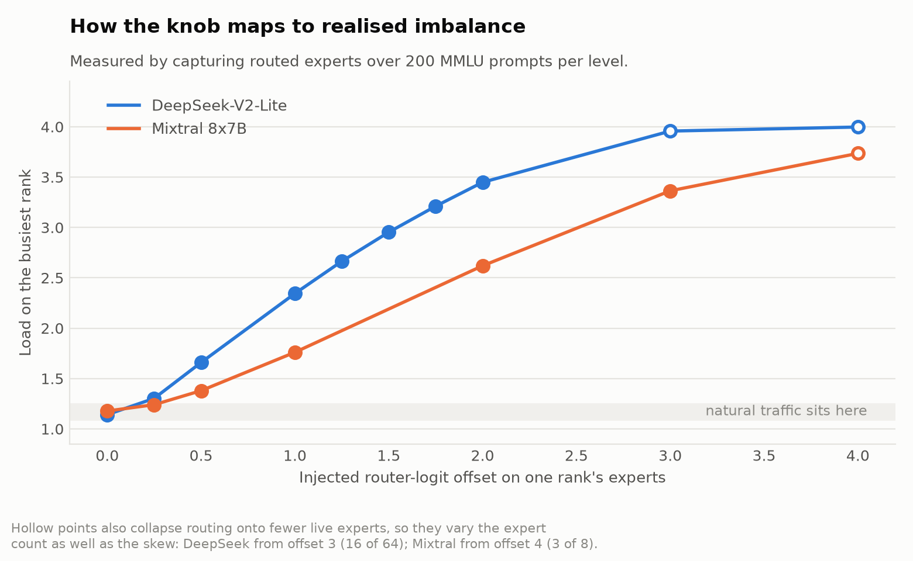
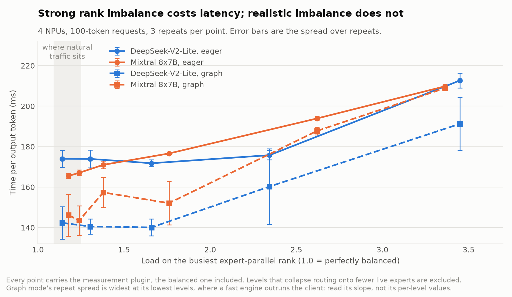
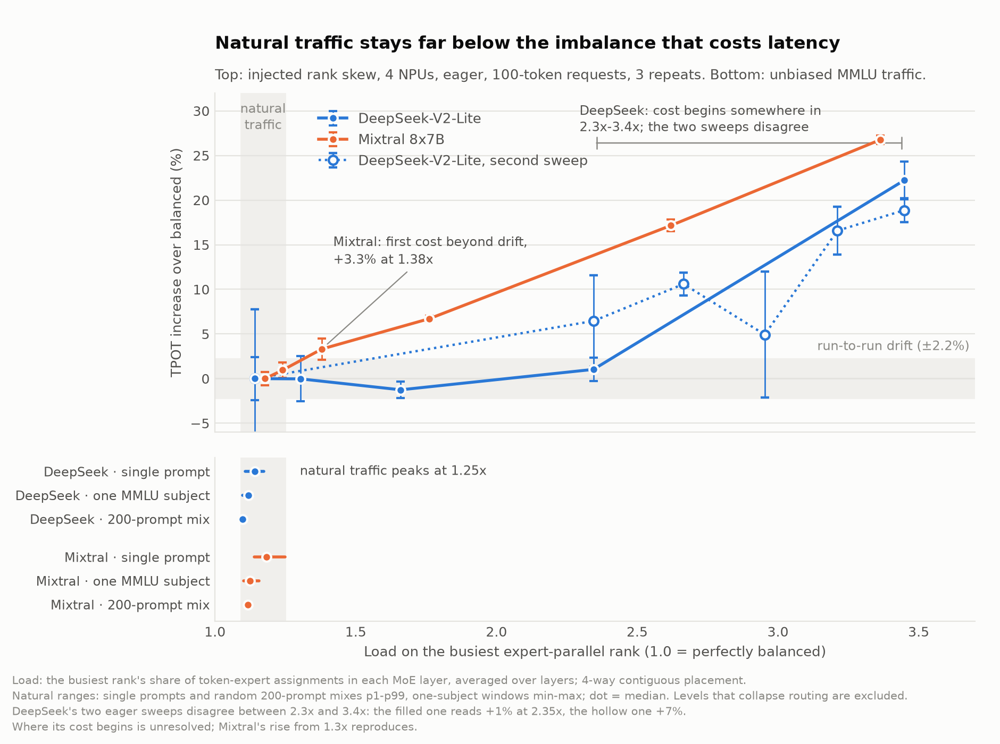
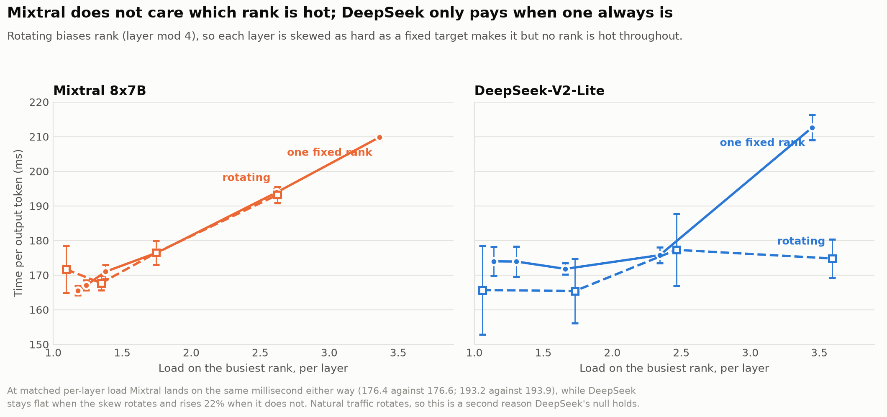
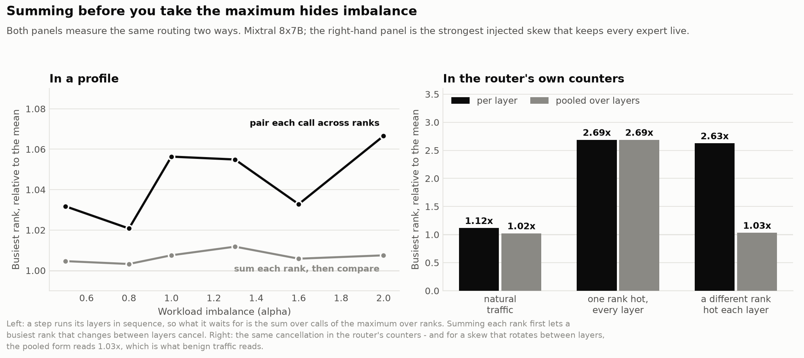
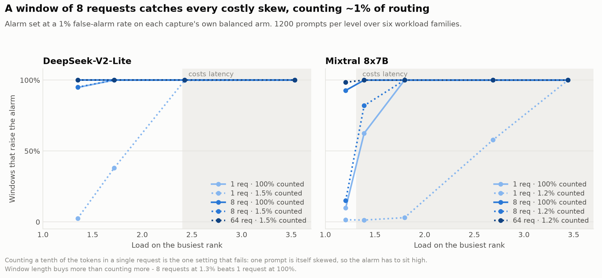
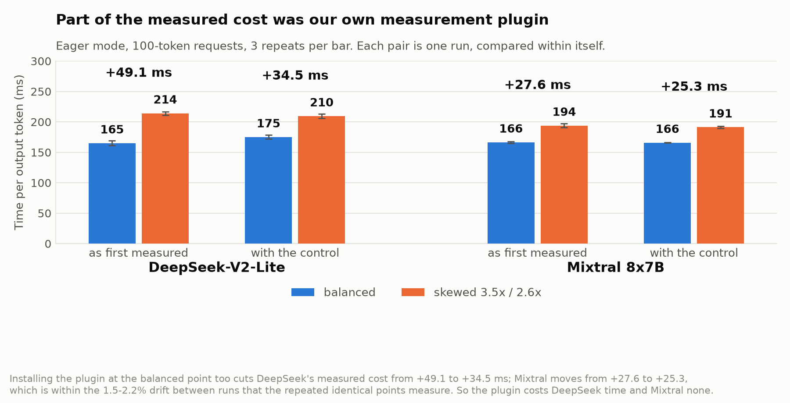
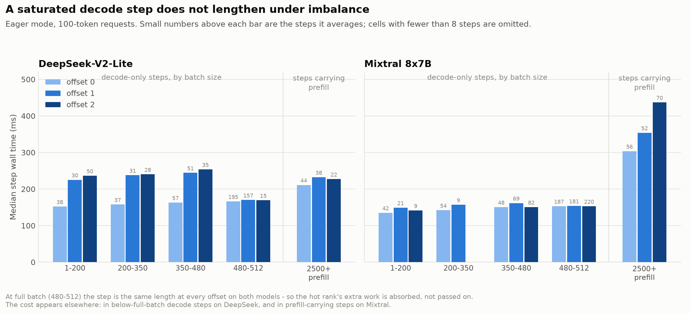

# Expert Load Imbalance on Ascend NPUs: What We Found

All results to 2026-10-08, in one place. Written to be read without knowing the
codebase. The per-experiment detail lives in [imbalance-findings.md](imbalance-findings.md),
[regime-findings.md](regime-findings.md), [router-bias-findings.md](router-bias-findings.md),
[drift-findings.md](drift-findings.md) and [detection-findings.md](detection-findings.md);
this document is the whole story and supersedes them as a summary.

---

## 1. The question, in plain terms

A Mixture-of-Experts (MoE) language model does not run every part of itself for
every word. Each layer holds many small sub-networks called **experts**, and a
small component called the **router** picks a few of them per token. That is what
makes these models cheap to run: a model with 64 experts might use 6 of them per
token.

To serve such a model you spread the experts across several accelerator chips.
With 64 experts and 4 chips, each chip holds 16. This is **expert parallelism**,
and the chips are called **ranks**.

The problem this project set out to measure: **the router does not spread work
evenly.** Some experts get picked far more often than others. If the popular
experts happen to sit on the same chip, that chip has more work to do, and
every other chip waits for it at the end of each layer. The slow chip is called
a **straggler**.

The received wisdom is that this costs real serving latency, and that it should
be fixed by moving experts between chips to even the load — which is what
vLLM's built-in **EPLB** (Expert Parallel Load Balancer) does.

**The question: how much does expert imbalance actually cost, and can we detect
the cases where it does?**

### The hardware and models

Everything ran on one machine with 8 Ascend 910B3 NPUs — Huawei's accelerators,
roughly comparable to a datacentre GPU — using vLLM Ascend 0.23.0. Two models:

| Model | Experts per layer | Picked per token | Experts per chip (on 4 chips) |
|---|---|---|---|
| DeepSeek-V2-Lite-Chat | 64 | 6 | 16 |
| Mixtral 8x7B | 8 | 2 | 2 |

They were chosen to be as different as possible in expert structure, so that a
result appearing on both is unlikely to be an accident of one model's shape.

### How we measure latency

**TPOT** — time per output token — is the headline number throughout. Once a
model has read your prompt, TPOT is the average time to produce each subsequent
word. It is what makes a chatbot feel fast or slow.

---

## 2. The headline: realistic imbalance costs nothing

**Under every realistic condition we tried, expert imbalance did not change
serving latency at all.** Not a small effect we couldn't resolve — no effect.

The cleanest run spans six different workload imbalance levels on 8 chips with
nothing else running on the machine: TPOT ranges from 130.04 to 130.87 ms, a
0.64% spread with no trend, while the predicted load on the busiest chip rises
from 1.18x to 1.31x of the average.

The same holds on Mixtral, which is the harder test. With 8 experts on 8 chips
each chip holds exactly one expert, so there is no averaging to smooth imbalance
out, and the expert computation is about 70% of the model's arithmetic rather
than 34%. Latency is still flat.

**This is not a failure to create imbalance.** Stragglers do form, and we can see
them in the profiles. The imbalance is real; it just doesn't cost anything.

### Why: two independent reasons, and they compound

**First, concentrating work makes the computation cheaper per unit.** The expert
computation is a matrix multiplication (`GroupedMatmul`). When tokens are spread
thinly, it runs many small multiplications; when they concentrate, it runs fewer,
larger ones, which hardware does far more efficiently. Pushing all traffic onto
6 of 64 experts cut the average call from 112 to 66 microseconds — a 41% saving.

The busiest chip does more work, but each unit of work costs less, and the two
very nearly cancel. **A 20% imbalance in token counts becomes only a ~2.6%
imbalance in actual time.**

> There is a boundary to this. It holds when each expert is handling few enough
> tokens that its cost is dominated by *loading its weights from memory* rather
> than by arithmetic. That is true during word-by-word generation (~48 tokens per
> expert per call). During the initial prompt-reading phase, where an expert sees
> ~384 tokens at once, the arithmetic dominates and concentrating work genuinely
> does make the busy chip slower — 1.6x slower in the extreme case. But the expert
> computation is only 10–16% of that phase's time, so even then the step
> lengthens by just 1.5–4.6%.

**Second, that remaining 2.6% is buried under something much larger.** When the
chips synchronise at the end of each layer, they call a *collective* operation.
We found that **about 95% of the time spent in those collectives is chips waiting
for each other, not transferring data.** And the resulting asymmetry in how long
each chip waits is around 33% — more than ten times anything imbalance produces,
and completely unrelated to it.

So there are two separate reasons imbalance cannot surface: it shrinks by a
factor of six on the way from token counts to time, and what is left is then
swamped.

### A result that inverts the obvious reading

While measuring the waiting, we found something counterintuitive that holds in
**30 out of 30** profiled measurements: **the chip that looks least busy is the
one everyone else is waiting for.**

The reason is that a chip which arrives *early* at a synchronisation point spends
the wait *inside* the collective operation — which the profiler counts as being
busy. The chip that arrives last waits least and therefore looks idle. Anyone
reading an occupancy chart at face value would blame the wrong chip.

Which chip this is changes between otherwise identical runs, and it has nothing
to do with expert load.

### EPLB rearranges correctly, and gains nothing

vLLM's load balancer works exactly as designed. Over 84 rearrangement cycles it
cut the token imbalance it measures from 1.139x to 1.007x.

The measured straggler went from 1.026x to 1.027x — unchanged.

**The reason is instructive: EPLB balances token counts, and what costs time is
time.** Token counts overstate the time imbalance by about six times, so EPLB is
carefully removing a 20% skew in a quantity that was already only 2.6% skewed in
the quantity that matters. There is nothing left to win.

Its one measurable effect is overhead: the expert share of compute falls 0.77
percentage points while the absolute expert time is unchanged, meaning EPLB added
work rather than saving any.

**For anyone building monitoring, this is the takeaway: expert token counters are
the wrong signal if you want to predict latency.**

---

## 3. But strong imbalance *does* cost latency

The null above is about *realistic* imbalance. To find where a cost appears, we
needed to push imbalance far past what normal traffic produces, in a controlled
way.

### The instrument

We add a fixed offset to the router's scores for one chip's experts, just before
it picks. That makes those experts win more often, by an amount we dial up and
down, while the routing still depends on the input and **every expert stays in
use**. (An earlier approach that edited the model's weights instead collapsed
routing onto 6 of 64 experts, which changes two things at once and so cannot
isolate the skew.)

The knob is not the result — what matters is the imbalance it actually produces,
which has to be measured per model, because the two models' routers use different
score scales. Hollow points mark settings where routing also collapses onto fewer
experts; those are excluded from everything that follows.

### The result

**Mixtral:** a clean, straight-line cost — TPOT rises about 12% for each
additional 1x of load on the busiest chip, from 165.5 ms balanced to 209.8 ms at
3.36x. This is the most statistically solid result in the project.

**DeepSeek:** the cost is large and real by 3.2–3.5x load, but its *shape* below
that is unresolved. Two sweeps disagree — one reads the cost as flat until 2.34x,
the other already sees +6.5% there — by more than either one's own repeat
spread. We do not currently know whether DeepSeek has a threshold or a gradual
slope.

Both hold in **graph mode**, which is how a production deployment would run. (One
caveat: graph-mode repeat spread is widest at the *low* imbalance levels, which
fits the engine outrunning the client that feeds it rather than any property of
imbalance. Read the slope, not the individual points.)

---

## 4. The key picture: where real traffic actually sits

A cost that appears at 1.4x imbalance only matters if real traffic reaches 1.4x.
So we measured what unbiased traffic actually produces, using the same statistic,
from recorded routing of thousands of real prompts.

**Natural traffic peaks at 1.25x**, and that is the worst case — the 99th
percentile of *single prompts*, which is the most concentrated window real
traffic offers. Windows of one topic reach 1.10–1.16x. Mixed traffic sits at
1.10–1.12x.

**The first cost that exceeds run-to-run noise is +3.3% at 1.38x** (Mixtral).

So there is a clear gap between what traffic produces and what costs anything.
That gap is the whole result: **imbalance is not a problem you have, it is a
problem you could have if something changed** — a router fault, an unusual
workload, or wider expert parallelism.

> Wider parallelism is the one lever that has moved the straggler: 1.04x at 2
> chips, 1.13x at 4, 1.31x at 8, extrapolating to ~1.6x at 16. That is the
> direction in which this null might stop holding.

---

## 5. It matters *which* chip is hot, and the models disagree

Every experiment so far made one chip hot in *every* layer. Real imbalance does
not look like that — we measured that in natural traffic, the busiest chip leads
only **34–35%** of layers, close to the 25% you would get by chance.

So we built the matched comparison: bias a *different* chip in each layer. Each
layer is skewed exactly as hard as before, but no chip is hot throughout.

**Mixtral does not care.** At matched imbalance the two land on the same
millisecond — 176.4 against 176.6 ms, and 193.2 against 193.9 ms. Its cost is a
property of each layer, not of which chip carries it.

**DeepSeek only pays when one chip is persistently hot.** A rotating skew is flat
across the entire range, where a fixed one costs +22% at the same imbalance.

This fits where each model's cost was already traced to: DeepSeek's lives in
partially-filled generation steps, where one chip being late at every layer
accumulates down the stack; Mixtral's lives in prompt-reading steps, where each
layer's own computation is on the critical path regardless of which chip it is.

**Consequence for the null:** natural traffic rotates. So DeepSeek's imbalance is
free for *two* reasons — it is small, and it is the kind that costs nothing even
when large. Mixtral's safety rests on smallness alone.

---

## 6. The measurement trap that runs through everything

The same mistake appears in three separate places, and it is the most
transferable thing we learned.

**To measure imbalance you must take the maximum before you sum, not after.**

A generation step runs its layers one after another. What it waits for is
therefore *the sum over layers of the worst chip in each layer*. If instead you
total each chip's work across all layers and then compare chips, a busiest chip
that changes from layer to layer cancels out.

The numbers are stark:

- **In profiles:** pairing each computation across chips gives a straggler of
  1.067x. Summing each chip first gives 1.004x — "perfectly balanced".
- **In routing counters:** natural traffic reads 1.12x per layer and 1.02x
  pooled.
- **Worst case:** a skew that rotates between layers reads **2.63x per layer and
  1.03x pooled** — the pooled form reports a genuinely strong, latency-costing
  imbalance as a balanced server.

**This matters beyond our project.** vLLM's own EPLB "balancedness" metric
computes the pooled form. In version 0.23, the one on our machine, a chip that is
hot in *every* layer reads as **1.00 — perfectly balanced**, which is exactly the
case that costs latency. Upstream has since fixed that reduction, but any
monitoring built on the shipped statistic is blind to the condition it should
catch.

---

## 7. Detecting the imbalance that matters

Given all the above, what would a practical monitor look like? We designed and
evaluated a three-stage pipeline.

| Stage | Reads | Runs | Answers |
|---|---|---|---|
| **1. Screen** | token-to-expert counts per layer and chip | always | is imbalance high? |
| **2. Confirm** | engine step times, by step type | on alarm | is it costing time? |
| **3. Attribute** | a short profiled window | rarely | which chip, and why? |

Stage 1's threshold comes from the measured **cost** curve, not from the load
distribution — because, as section 5 showed, the same load costs full price on
one model and nothing on the other.

### It works, and it is cheap

Counting just **1.2–1.5%** of token-to-expert assignments (4 layers out of 26–32,
a tenth of their tokens) over a window of **8 requests** flags *every* imbalance
level that costs latency, on both models, at a 1% false-alarm rate.

**Window length matters far more than how much you count.** One request at 100%
counted performs *worse* than 8 requests at 1.3%. A single prompt is itself
skewed, so its benign spread is wide and the alarm has to sit high — the screen
then goes blind to exactly the levels that matter.

### One alarming window is not an alarm

A 1% false-alarm rate per window sounds small. It is not: it means a false alarm
every few hundred requests. Requiring **two consecutive** alarming windows fixes
it — detection 98–100%, early firing 0–1%, one false alarm per 1200–1750
requests — at a cost of 16 requests of delay.

### Adjusting cost against accuracy

The counting is not the expensive part. What costs is what the screen *triggers*:
a profiled confirmation measured at **+15–19% TPOT while it runs**.

| Window | Consecutive windows | Detection | Delay | Amortised cost |
|---|---|---|---|---|
| 8 | 1 | 0.50–0.76 | 8 reqs | **3.1–6.1%** |
| 8 | 2 | 0.98–1.00 | 16 reqs | 1.3–1.8% |
| **8** | **3** | **1.00** | **24–40 reqs** | **0.2%** |

**Requiring three consecutive windows improves accuracy and cost at the same
time**, for a few dozen requests of delay. Cutting the sampling further would be
the wrong economy — it is already the small term.

### It can say *where*, not just *whether*

Because the counts are per layer, the screen can report which layers are affected
and whether one chip carries them. With a skew confined to 6 of 26 layers on
chip 2 — where the model-wide average reads a near-benign 1.40x — per-layer
flagging recovered **exactly those 6 layers, named chip 2, and flagged nothing in
the balanced case.**

That distinction is directly actionable: a skew that one chip carries throughout
might be fixed by moving experts; one that rotates between layers cannot be, and
there is no point trying.

---

## 8. Detecting router faults (a separate question)

A related question: can you tell from expert load alone that the *router itself*
has changed, as opposed to the traffic changing?

**For gross faults, yes.** A router collapsing onto 6 of 64 experts scores 37x
above the benign ceiling — perfect separation.

**For subtle faults, no.** A router that misroutes less than roughly 10–20% of
its decisions is hidden by ordinary variation in what users ask about. The
limiting noise is the *workload*, not statistics: normal topic variation produces
7x more apparent drift than sampling error.

The fix is to stop comparing different traffic. Replaying a fixed set of
**canary** prompts compares routing on identical inputs, which removes the
confound by construction rather than statistically. Recorded data suggests this
lowers the noise floor by about 80x. One caveat found along the way: identical
prompts do not route identically — about 2% of decisions flip — so the floor is
not zero, and generated-token routing diverges enough that it must be excluded.

---

## 9. How we got things wrong

Several results looked real and were not. These cost the most time and are the
most reusable.

**A measuring instrument that was missing from the control.** Our router-bias
plugin runs on every chip at every imbalance level — except zero, where it wasn't
installed at all. So every comparison against "balanced" included the
instrument's own cost. It was 10.0 ms per token on DeepSeek and nothing on
Mixtral, and it inflated DeepSeek's measured cost by 43%.

Worse, it could not be corrected afterwards: the plugin was present at exactly
the non-zero levels, so its cost is mathematically indistinguishable from a real
jump at the first non-zero level. The affected runs had to be repeated.

**Three apparent effects dissolved under repetition.** Single elevated readings
looked like thresholds and turned out to be the machine. Repeating each
measurement is the only noise floor available.

**Statistical significance from the wrong unit.** Comparing thousands of
individual requests gave p-values below 1e-90 for differences that repetition
showed to be noise. All requests in one measurement share a server, a warm-up and
a scheduling pattern — the unit of replication is the run, so n = 1 per point,
not 1000.

**A hidden confound between imbalance and batch size.** Building workloads to a
fixed token budget meant more imbalanced workloads automatically used more,
shorter prompts. Imbalance and request count were 98% correlated, and the
resulting "effect" vanished at a fixed request count.

**Averaging over a profiling window compares different workloads.** The mix of
step types shifts with the parameter being swept, so window averages disagreed
with end-to-end latency by 1.5–3x. Steps must be matched by type and size before
comparing.

**Another user's job on the same machine** costs about 3% TPOT and 31% prompt
latency even on chips our run was not using. Every measurement now records
whether anyone else was present.

---

## 10. What we would tell someone deploying this

1. **Expert imbalance is not currently costing you anything** on this stack, at
   up to 8-way expert parallelism, for normal traffic.
2. **Do not enable EPLB expecting a latency win.** It rearranges correctly and
   gains nothing, because it balances token counts and the cost is in time.
3. **If you monitor imbalance, use the per-layer statistic.** The pooled form —
   including the one vLLM's EPLB logs in 0.23 — reports the worst realistic case
   as perfectly balanced.
4. **A cheap monitor is enough.** ~1% of routing counted, over 8 requests, with
   three consecutive alarms required.
5. **Treat an alarm as "look here", never as "this is costing you."** The same
   imbalance costs full price on one model and nothing on another.
6. **Watch expert-parallel width.** It is the one lever that has raised the
   straggler, and it is heading towards the band that costs latency.

---

## 11. What is still open

**Mechanism.** We know *that* strong skew costs latency and we know *where* in a
step it appears, but not *why*. Two explanations have already been proposed and
retracted on further measurement.

**DeepSeek's shape.** Whether its cost starts near 2.3x or only above 3x is
unresolved; two sweeps disagree. The prior puzzle is why the same configuration
gives a repeat spread of 2–5 ms in one run and 9–14 ms in another — the *quieter*
machine gave the noisier run.

**The monitor's own cost on the device.** We can price the whole pipeline from one
number — the cost of incrementing a counter per routing decision — and that number
has not been measured on hardware.

**Imbalance that ramps or flickers.** Every measurement uses a server whose
imbalance is fixed for its lifetime. Detection delay has only been measured for an
instantaneous onset into a standing skew.

**Wider expert parallelism**, which is the most likely way the null breaks.

**Stage 2's discriminating power.** The rotating-skew result gives the sharpest
possible test — two cases with identical imbalance where one costs full price and
the other nothing — and the measurement is running now.

---

## Appendix: reproducing the figures

`scripts/plot_findings.py` regenerates every figure in this document from the run
records under `results/`, and writes `figures/figures.json` with every plotted
number. `scripts/detection_eval.py` regenerates the detection analysis into
`detection.json`. Neither hard-codes a result; both name the runs they read.

Two routed-expert captures are needed for the traffic figures and are excluded
from the default sync because of their size — see [usage.md](usage.md).
